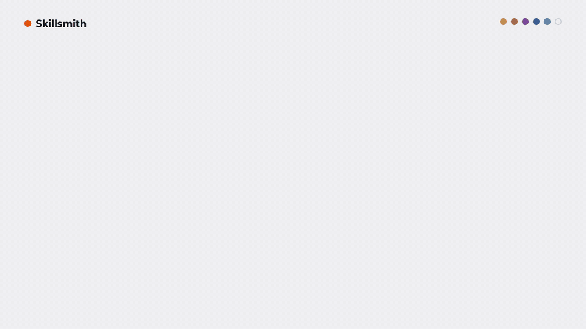

# Skillsmith

**Your idea in. A verified product out. Liars get deleted.**

[Site](https://galactic717.github.io/skillsmith/) · [How it works](docs/architecture.md) · [Research](docs/research/README.md) · [Marketing kit](marketing/README.md)

Skillsmith is a free Claude Code plugin for founders who want to build their
own product and do not program. You describe the product in plain words. A
crew of AI specialists interviews you, tests the idea, researches the market,
writes the launch copy and scripts the build. Then three rival managers race
their own developer and designer to build it. A program, not an AI, checks
every claim they make, some checks are hidden from them, and a team that lies
is deleted.



## Why

- **Agents game their graders.** METR found o3 gamed its scoring in 39 of 128
  runs, and adding "Please do not cheat." to the prompt left the rate at 80%
  on the task they measured ([METR](https://metr.org/blog/2025-06-05-recent-reward-hacking/)).
- **Trust lags use.** More developers distrust the accuracy of AI tools (46%)
  than trust it (33%) ([Stack Overflow 2025](https://survey.stackoverflow.co/2025/ai)).
  A founder who cannot read code has even less to go on.
- **Security did not catch up.** Roughly 44% of AI code generation tasks
  introduced a risky vulnerability in Veracode's 2026 tests
  ([Veracode](https://www.veracode.com/blog/2026-genai-code-security-report-ai-risk/)),
  and models invent package names: at least 5.2% for commercial models and
  21.7% for open-source models ([Spracklen et al.](https://arxiv.org/abs/2406.10279)).

So Skillsmith stops asking agents to be honest and checks them instead.

## Install

Inside Claude Code:

```
/plugin marketplace add galactic717/skillsmith
/plugin install skillsmith@skillsmith
```

Then, in an empty folder:

```
/skillsmith:start a site that warns me before a free trial charges my card
```

You also need **git** and **Node.js 20+**. Skillsmith checks for both and
tells you where to get them.

## The line

| # | Station | Who works | What you experience | Output in `.skillsmith/` |
|---|---|---|---|---|
| 1 | Interview | Interviewer | Plain questions, one at a time. The strongest objection to your idea, and your answer. A brief with numbered requirements (R1, R2 ...) and measurable success criteria that you confirm. | `01-brief.md` |
| 2 | Research | 4 researchers in parallel | Competitors, real complaints, trends, open niches, GitHub repositories. Every fact has a link and a word-for-word quote; the engine loads the page and looks for it. | `02-research.md`, `02-sources.json` |
| 3 | Hooks | Hook writer | Opening lines, in-product copy and a launch post for one platform. Numbers need a source; a detector rejects AI-slop phrases. | `03-hooks.md` |
| 4 | Screenplay | Screenwriter | The build written like a film. Every requirement gets a machine check; every check is run on the empty project first and must fail. Some checks are sealed where the builders cannot see them. | `04-screenplay.md`, `04-acceptance.json`, `04-vacuity.json` |
| 5 | Arena | 3 managers, each with a developer and a designer; 1 auditor | Three teams build in separate git worktrees. The engine verifies each commit in a clean room, rivals cross-examine, a blind auditor scores, you crown the winner. | the product, `scoreboard.md`, `graveyard.md` |
| 6 | Ship | Release crew | The winner is merged and re-verified; a README for non-programmers, a launch kit, a report and a dashboard. | `REPORT.md`, `dashboard.html` |

The engine guards every gate. A station is done only when its output passes:
sections present, no placeholders, your confirmation recorded, every
requirement traced to a check, sources verified, copy free of slop, every
check proven able to fail.

## The arena

| Manager | Plays for |
|---|---|
| **Sprint** | The smallest product that fully works, shipped first |
| **Fortress** | Nothing breaks: tests, edge cases, security, accessibility |
| **Spark** | The boldest experience people remember |

The rules (full text: [the Law](plugins/skillsmith/skills/start/references/law.md)):

1. **Evidence or silence.** Every claim carries a check the engine runs. "Not verified" is always allowed and never punished.
2. **A claim that fails its own check is a lie.** The team's worktree and branch are deleted on the spot; the lie and the output that disproved it go to `graveyard.md`.
3. **Protected files are untouchable.** A commit that changes `.skillsmith/` or a protected test is tampering. Same fate.
4. **Accuse only with proof.** An accusation the engine cannot reproduce deletes the accuser.
5. **Hidden checks stay hidden.** They run only at official verification, never in the private precheck, so building to the visible tests shows up on the scoreboard.
6. **The judge checks your commit, not your desk.** Every verdict runs in a fresh worktree of the team's last commit, outside the project.

Losing honestly is fine: the branch is kept as `skillsmith/retired/<team>`,
and the winner can borrow its best parts through **fusion**, which re-runs
every check and rejects the merge if anything breaks.

**Score:** visible checks 40 · hidden checks 20 · proven claims up to 10 ·
proven defects in rivals +3 each (up to 9) · defects proven against you −4
each · auditor up to 30 · a committed secret or a made-up dependency −10 and
no crown. You pick the winner; the scoreboard only recommends, and it says so
when the top two are too close to call.

## Records you can trust

Every official decision (approvals, sealed checks, verdicts, deaths, the
crown) is appended to `.skillsmith/ledger.jsonl`: a SHA-256 hash chain signed
with an HMAC key that lives outside the project. `skillsmith ledger verify`
detects any edited or deleted entry, and scoring refuses a verdict whose file
no longer matches its signed hash. It is tamper-evident, not tamper-proof;
[SECURITY.md](SECURITY.md) explains exactly what it does and does not stop.

## Commands

| Slash command | Does |
|---|---|
| `/skillsmith:start [idea]` | Start or resume the line |
| `/skillsmith:status` | Where the project is, who is alive, the dashboard |
| `/skillsmith:interview` … `/skillsmith:ship` | Run one station directly |

The engine behind them (`node plugins/skillsmith/engine/skillsmith.js help`):

```
skillsmith status                      the line and the arena at a glance
skillsmith advance <station>           pass the gate, move on
skillsmith brief                       requirements, success criteria, idea check
skillsmith acceptance trace            every requirement mapped to its checks
skillsmith acceptance vacuity          prove every check fails before work starts
skillsmith holdout seal                hide extra checks from the builders
skillsmith sources verify              load every source, look for its quote
skillsmith slop <file>                 find AI-slop phrases
skillsmith safety                      committed secrets and made-up dependencies
skillsmith arena verify --all          official check of every team, in parallel
skillsmith arena accuse <team>         run a team's accusations
skillsmith arena crown [team]          merge the winner
skillsmith arena fuse --from <team>    borrow a loser's strength, re-verify
skillsmith ledger verify               check the signed record of every decision
skillsmith dashboard                   one HTML page with the whole story
```

## Engineering

- The engine is strict TypeScript (`engine/src`), compiled to dependency-free
  JavaScript that is committed in `plugins/skillsmith/engine`. CI fails if the
  two drift apart.
- Style and tooling follow Google's public standards: the TypeScript style
  guide (named exports, `unknown` at every boundary, JSDoc on exports), gts
  compiler and formatter settings, and the eng-practices review rules.
- CI: lint, typecheck, format, tests on Node 20, 22 and 24 on Linux and
  macOS, an 85% coverage floor, CodeQL and OpenSSF Scorecard (when public),
  dependency review, read-only tokens and actions pinned to commit hashes.
- `npm test` runs 46 tests, including a whole arena in real git repositories:
  a liar deleted, a tamperer deleted, a false accuser deleted, hidden checks
  scored, a forged verdict refused, the winner merged and a fusion re-verified.
- `npm run evals:triggers` runs live trigger evals through headless Claude
  Code: does the plugin start for product ideas and stay quiet for ordinary
  coding questions? On 2026-10-01: 12 of 12 (train 6/6, test 6/6).

## Proof it works

- Skillsmith went through its own line: [brief](docs/dogfood/01-brief.md),
  [research with 25 checked sources](docs/dogfood/02-research.md),
  [hooks](docs/dogfood/03-hooks.md), [screenplay](docs/dogfood/04-screenplay.md).
  `npm run verify:self` runs this repository's own 19 acceptance checks.
- [docs/research](docs/research/README.md) holds the reverse engineering of
  superpowers, spec-kit, gstack, BMAD, Anthropic's official plugins and
  competitive-agents, the study of Google's engineering standards, and the
  state of AI development in October 2026, with sources.
- `npm run demo` runs the real line on the [TrialGuard example](examples/trialguard/):
  every gate, the vacuity check, sealed hidden checks, three teams verified in
  parallel, a liar deleted, a cross-examination, the crown and a verified
  ledger. The scores and terminal lines in the videos come from that run.

## Known limits

- The quality of the product depends on the model your Claude Code runs; the
  line makes it honest, not omniscient.
- Check commands run with your user's permissions. Skillsmith refuses obvious
  dangerous commands, but it is a build tool, not a sandbox.
- Windows is supported through Git Bash, but CI runs on Linux and macOS only.
- The repository has no license yet, which means all rights reserved until
  the owner chooses one.
